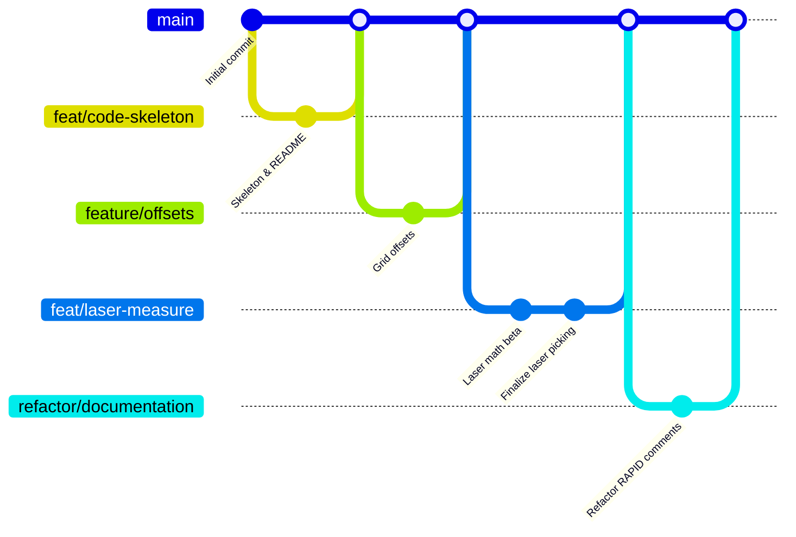

# Project Overview: Robot Sorting (Orange Robot)

This project controls an **ABB IRB120 6-axis robot** to automatically process workpieces from a 4x4 grid (S1), inspect them for quality, and transfer them to a destination grid (S4) on a second platform.

## Features & Contributions

| Feature                   | Contributor | Implementation Detail                                                                            |
| :------------------------ | :---------- | :----------------------------------------------------------------------------------------------- |
| **Grid Calibration**      | **Simona**  | Standardized grid offsets to **58mm** based on physical measurements.                            |
| **Snake-Loop Navigation** | **Simona**  | Implemented optimized traversal logic (even rows L->R, odd rows R->L).                           |
| **Interactive UI**        | **Ivan**    | Created FlexPendant `TPReadFK` dialogs for operator authorization.                               |
| **State Tracking**        | **Ivan**    | Integrated boolean process flags (`operatorReady`, `blockPicked`) for HMI/PLC sync.              |
| **Gripper Feedback**      | **Bea**     | Implemented `DI_GripperClose` monitoring with a 1s settling delay.                               |
| **Error Handling**        | **Bea**     | Added logic to detect and skip empty grid slots, updating statistics without stopping the cycle. |
| **Dual-Platform Logic**   | **Maks**    | Established the transfer logic from `pGrid_Pick_Ref` (S1) to `pGrid_Dest_Ref` (S4).              |
| **Architecture**          | **Maks**    | Consolidated all individual feature branches into a unified `g1-code.mod` module.                |

## Remaining Tasks

| Member     | Task                | Description                                                                             |
| :--------- | :------------------ | :-------------------------------------------------------------------------------------- |
| **Ivan**   | **PLC Handshake**   | Map and implement physical `SetDO` signals for `Robot_Busy` and `Robot_Done`.           |
| **Bea**    | **Color Mapping**   | Update `MeasureColor` with real `DI` signal checks for Blue, Green, and Yellow.         |
| **Simona** | **Grid Validation** | Run a full 4x4 simulation to ensure the 40mm offset aligns perfectly with the 3D model. |
| **Maks**   | **Point Teaching**  | Verify and fine-tune the absolute coordinates of the `pGrid_Dest_Ref` station.          |

## Hardware Configuration

- **S1 (Pickup):** `pGrid_Pick_Ref`
- **S4 (Destination):** `pGrid_Dest_Ref`
- **S2 (Sensor):** `pSensor_Measure`
- **I/O Signals:** `DO_Gripper`, `DI_GripperClose`

## Development Workflow

1. Pull the latest `feat/consolidated-features` branch.
2. Edit `g1-code.mod` in VS Code.
3. Load module into RobotStudio (`T_ROB1`).
4. Set Program Pointer (PP) to `main` and run simulation.

## Development & Branching History

This project followed a **Feature Branch Workflow** to ensure code stability and collaborative development. You can view the live interactive commit graph on GitHub:

👉 **[View Interactive GitHub Network Graph](https://github.com/M0zzi3/technology-for-industry-group1-orange-robot/network)**

### Branching Strategy

