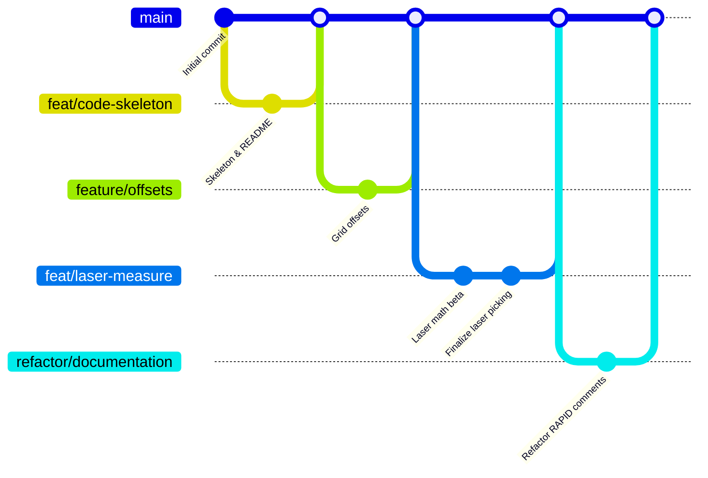

# Project Overview: Robot Sorting (Orange Robot)

This repository contains the RAPID source code for an **ABB IRB120 (Orange)** industrial robot, programmed for automated quality inspection and sorting. The system traverses a 4x4 pickup grid, uses a laser sensor for dynamic height detection, inspects the color of each workpiece, and transfers approved items to a destination platform.

## System Architecture

The robot operates across four distinct "Stations" defined in the global coordinate system:

- **S0 (Home):** Safe resting position.
- **S1 (Pickup Grid):** A 4x4 grid where raw workpieces are placed.
- **S2 (Color Sensor):** An inspection station for quality validation.
- **S4 (Destination Grid):** A second 4x4 platform for processed workpieces.

## Features & Final Implementation

### Dynamic Laser Picking

Unlike standard "blind" robots, this system uses a **Sick distance sensor** to measure workpieces in real-time.

- **Presence Detection:** The robot skips empty cells automatically if the laser detects the table floor (-50).
- **Height Calculation:** The robot calculates the exact Z-descent required based on the laser reading, allowing it to handle mixed batches of tall and short blocks.
- **Hardware Alignment:** Because the laser is offset from the gripper, the software automatically "shifts" the robot coordinates by a calibrated offset (`LASER_OFFSET_X/Y`) before picking.

### Optimized Navigation (Snake-Wise)

To minimize mechanical wear and cycle time, the robot traverses the grids in a "Snake" pattern. It reverses its direction for every second row to avoid long travel moves back to the start of a line.

### Multi-Tier Error Handling

The system is designed for industrial reliability with four specific fault responses:

1. **Empty Spot:** Non-critical. Increments the `count_empty` statistic and skips to the next cell.
2. **Gripper Miss:** Critical. If the pneumatic feedback (`DI_GripperClose`) is lost after a pick, the robot stops immediately to prevent potential collisions.
3. **Sensor Failure:** Critical. If the color sensor provides no signal, the system assumes a hardware fault and stops the cycle.
4. **Invalid Color:** Informational. If an unrecognized color (e.g., Red) is detected, it is logged, but the cycle continues to maintain batch flow.

## Lab Calibration Guide

Before running the code in a new environment, verify these physical parameters:

- **LASER_OFFSET_X:** The exact mm distance between the laser beam and the gripper center.
- **EMPTY_THRESHOLD:** The analog value returned when the laser points directly at the table surface (currently -50).
- **Reference Points:** Re-teach `pGrid_Pick_Ref` and `pGrid_Dest_Ref` to align the virtual grid with the physical hardware.

## Execution Instructions

1. Pull the `main` branch.
2. Load `g1-code.mod` into the ABB RobotStudio or the physical IRC5 controller.
3. Set the Program Pointer (PP) to `main`.
4. Monitor the FlexPendant for the **"READY"** authorization prompt.

## Development & Branching History

This project followed a **Feature Branch Workflow** to ensure code stability and collaborative development. You can view the live interactive commit graph on GitHub:

👉 **[View Interactive GitHub Network Graph](https://github.com/M0zzi3/technology-for-industry-group1-orange-robot/network)**

### Branching Strategy

---

_Developed by Group 1 (Maks, Simona, Ivan, Bea) as part of the Technology for Industry 2026_
